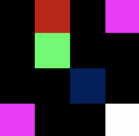

# pixmap-ops

Image manipulation demos based on the PPM image format.

TODO: Add a representative image for your project here

Representative Image - TV Buffering Colors on Earth:


## How to build

*Windows*

Open git bash to the directory containing this repository.

```
pixmap-ops $ mkdir build
pixmap-ops $ cd build
pixmap-ops/build $ cmake -G "Visual Studio 17 2022" ..
pixmap-ops/build $ start pixmap-ops.sln
```

Your solution file should contain two projects: `pixmap_art` and `pixmap_test`.
To run from the git bash command shell, 

```
pixmap-ops/build $ ../bin/Debug/pixmap_test
pixmap-ops/build $ ../bin/Debug/pixmap_art
```

*macOS*

Open terminal to the directory containing this repository.

```
pixmap-ops $ mkdir build
pixmap-ops $ cd build
pixmap-ops/build $ cmake ..
pixmap-ops/build $ make
```

To run each program from build, you would type

```
pixmap-ops/build $ ../bin/pixmap_test
pixmap-ops/build $ ../bin/pixmap_art
```

## Image operators

TODO: Document the features of your png image class here. Include example images.

Features:
1. resize - resizes the image:                                


2. flipHorizontal - flips the image along the horizontal line:  


3. flipVertical - flips the image along the vertical line:  


4. rotate90 - rotates the image 90 degrees to the left:  


5. subimage - returns subimage of image at specified location:  


6. replace - replaces the image at specified spot with another image:  


7. swirl - swirls the pixel colors in an image:     


8. add - adds the pixel colors of two images:                                 


9. subtract - subtracts the pixel colors of two images:                         


10. multiply - multiplies the pixel colors of two images:                              


11. difference - find the abs difference of the pixel colors of two images:                          


12. lightest - gets the max pixel colors of two images:                            


13. darkest - gets the min pixel colors of two images:                            


14. gammaCorrect - gammaCorrection is applied to the image:

  

15. alphaBlend - blends image with another image by an alpha factor:
  

16. invert - inverts the colors of the image:


17. grayscale - grayscales the image's pixel colors:


18. exrtractRed - extracts only the red color channel:


19. exrtractGreen - extracts only the green color channel:


20. exrtractBlue - extracts only the blue color channel:


21. onlyRed - keeps only the red color channel:


22. onlyGreen - keeps only the green color channel:


23. onlyBlue - keeps only the blue color channel:


24. border - creates a border around the image:


25. grainyEffect - creates a texturized image (made specifically for brick image):  


26. tvcolors - overlays tv buffering colors onto the image:


## Results 

TODO: Show artworks using your class

